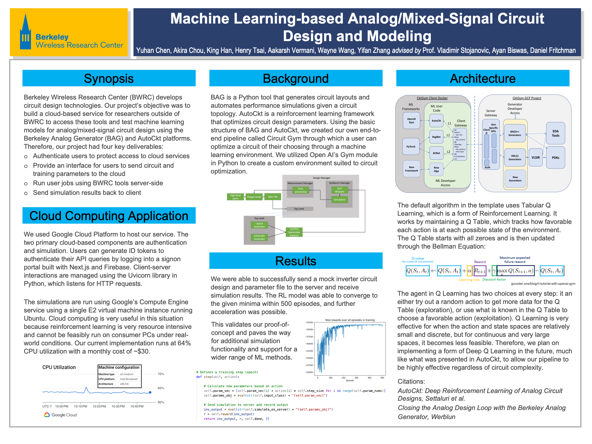

## Microsoft Research - Research Fellow

- Used TypeScript and C# to prototype the new Office AI for Excel.
- Used TensorFlow to improve a key ML classification model (LSTM + CRF). Increased F1 score from 72 to 77.

### Links

- 🔭 [Spreadsheet Intelligence @ Microsoft Research](https://www.microsoft.com/en-us/research/project/spreadsheet-intelligence/ "Spreadsheet Intelligence")

## Berkeley Wireless Research Center (BWRC) ML Discovery - Researcher

<iframe src="https://cktgym-1.web.app/" title="CktGym" width="100%" height="500" allowfullscreen></iframe>

- Led a team of 5 researchers to develop a client-server interaction framework for circuit design and a reinforcement-learning library for circuit optimization.

### Links

- 🐈‍⬛ [GitHub organization](https://github.com/BWRC-AMS-ML-Discovery "BWRC-AMS-ML-Discovery")
- 🎓 [Runner-up for the Cloud Computing Application Award at the Spring 2023 cohort of Discovery (UC Berkeley Data Science)](https://data.berkeley.edu/spring-2023-data-science-discovery-showcase-highlights "Spring 2023 Data Science Discovery Showcase Highlights")
- 📂 [Download posters](https://drive.google.com/drive/folders/1b1sjmVJH7EwcdUiGcZRs_Y35F_5HFe8X "Posters")
