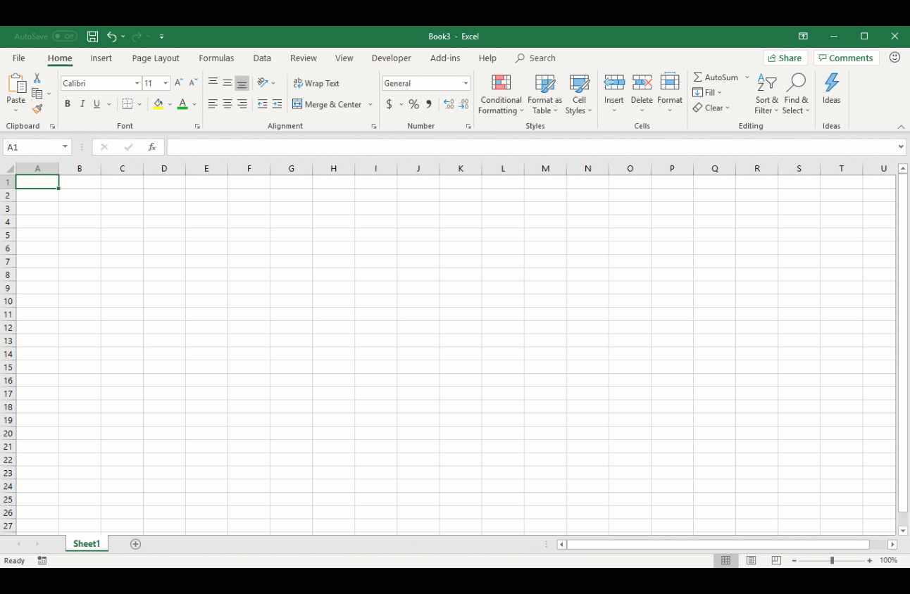

## 🪟 Microsoft Research

<h2 style="margin-top: 0"><i>Research Fellow</i></h2>

- Used TypeScript and C# to prototype the new Office AI for Excel.
- Used TensorFlow to improve a deployed ML classification model (LSTM + CRF). Increased F1 score from 72 to 77.

### Links

- 🔭 [Spreadsheet Intelligence - Microsoft Research](https://www.microsoft.com/en-us/research/project/spreadsheet-intelligence/ "Spreadsheet Intelligence")

---

## 💫 Berkeley Wireless Research Center (BWRC)

<h2 style="margin-top: 0"><i>Researcher</i></h2>

<!-- <iframe src="https://cktgym-1.web.app/" title="CktGym" width="100%" height="500" allowfullscreen></iframe> -->

- Led a team of 5 researchers to develop an ML service for circuit design on GCP and a reinforcement-learning library for circuit optimization.

### Links

- 🐈‍⬛ [GitHub](https://github.com/BWRC-AMS-ML-Discovery/BwrcAmsMlDiscovery "BwrcAmsMlDiscovery")
- 🎓 [Runner-up for the Cloud Computing Application Award at the Spring 2023 cohort of Discovery (UC Berkeley Data Science)](https://data.berkeley.edu/spring-2023-data-science-discovery-showcase-highlights "Spring 2023 Data Science Discovery Showcase Highlights")

---

## 👔 Additional Experience

> More experience can be found on my [LinkedIn](https://www.linkedin.com/in/kingh0730/ "Shangdian (King) Han").
