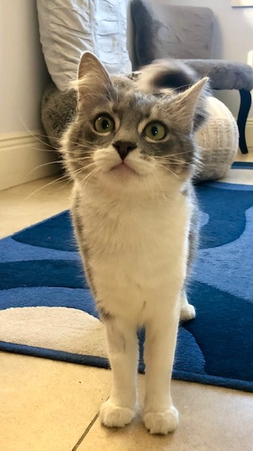

# Welcome 欢迎

Hi! My name is Shangdian Han. I go by King. I'm a junior studying math and CS at the University of California, Berkeley. In my free time, I like thinking about education and politics (in particular, anything related to China).

Hello！我叫韩尚典，目前在加州伯克利读大三，选修数学+计算机双专业。业余时间，我喜欢思考教育与政治（尤其是与中国有关的）。

# Contact 联系

Email 邮箱：[kingh0730@berkeley.edu](kingh0730@berkeley.edu)

[LinkedIn](https://www.linkedin.com/in/kingh0730/) &emsp; [GitHub](https://github.com/kingh0730) &emsp; [Twitter](https://twitter.com/kingh0730) &emsp; [Facebook](https://www.facebook.com/kinghan0730/) &emsp; [Instagram](https://www.instagram.com/kingh0730/) &emsp; [Bilibili](https://space.bilibili.com/23775735)

WeChat/微信/QQ：767673599

WeChat QR Code 扫码添加微信：

# A note on my name 我的英文名

My real given name is 尚典 (shàng diǎn). However, my mom also gave me another name 金 (jīn), which is pronounced as "kim" in Korean. The most natural choice for my English name would be Jin or Kim. My mom liked neither and thought: How cool would it be if I name my son King? And that's how I got my name.

我本名“韩尚典”，但是我妈给我起了个小名叫“韩金”。要上幼儿园了，取啥英文名呢？我妈觉得“Jin”也不好听，"Kim"也不好听。突然她一拍脑袋：那就叫“King”吧！于是我就叫King了。

# Tata 塔塔

I'm the chief poop-scooping officer for a cat named Tata. Here are some pictures of her:

我是一位铲屎官，服务一只名为塔塔的猫。她的美照：

